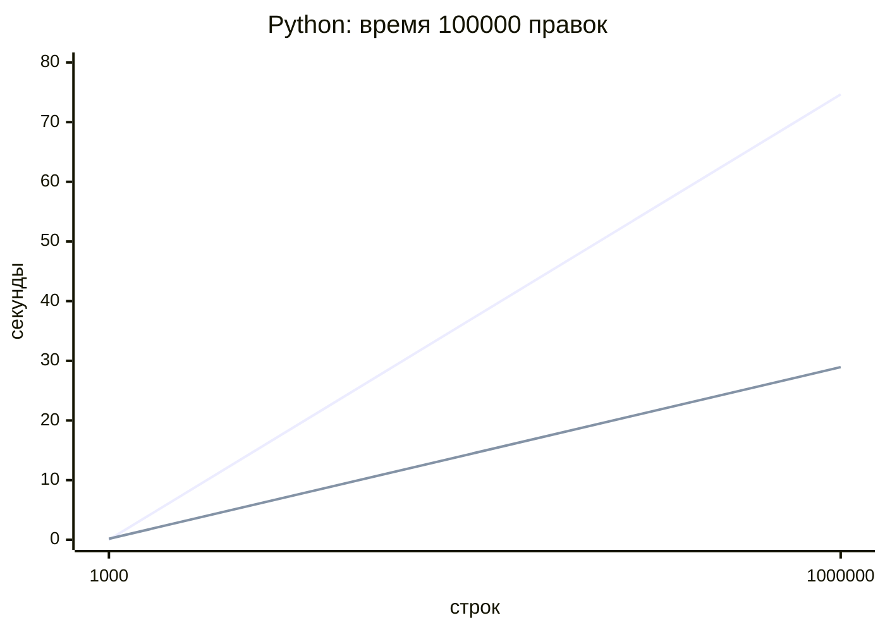
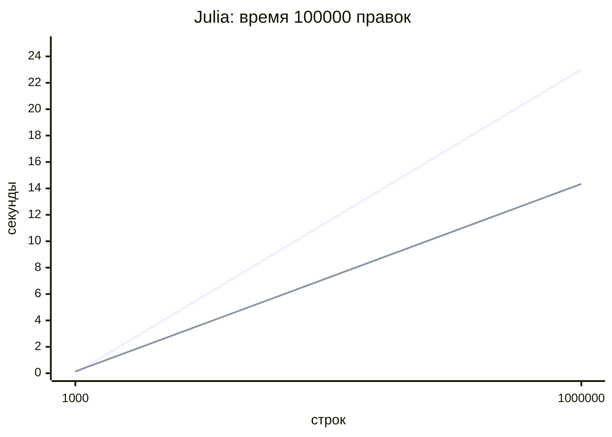

# ВНИМАНИЕ: Опыт не доведен до идеала. Я не все до конца понял. Огромные части кода сгенерированы ИИ агентом. На данный момент я НЕ СПОСОБЕН защитить эту практику. Код, отчет и прочее могут, и, вероятно, БУДУТ изменены.

# Практикум 4. Задание 3 - цена неизменяемости

## Условия опыта

Реализованы три способа вести журнал строк редактора на Python и Julia: один изменяемый список с обратными операциями, полное копирование списка после каждой правки и список блоков по 256 строк с общими неизменёнными блоками. В обоих языках использован один сценарий: 100 000 действий, попеременно вставка строки в середину и удаление её оттуда. Проверены документы в 1000 и 1 000 000 строк. Для отката хранятся последние 100 версий или обратных действий. Все исходные строки одинаковы, чтобы сравнивать стоимость структуры, а не создания текстов.

ПК: Windows 11 Pro, Intel Core i5-14400F, 32 ГБ ОЗУ. Python 3.13.15, Julia 1.12.7. Время - секунды на один прогон. Это не среднее по многим повторам: длинный опыт с миллионом строк специально запущен один раз. Фоновые процессы и сборка мусора могут сдвинуть результаты.

Команды из папки `PLT/practice_4/task3`:

```powershell
python task3.py
julia -t 4 task3.jl
python task3.py --bench
julia -t 4 task3.jl --bench
```

Без `--bench` выполняются быстрые проверки вставки, удаления, сохранности старого состояния, пустого документа, документа из одной и 1000 строк, серии из 100 операций и удаления за пределами документа. Проверен переход «удалили последнюю строку — вставили новую». Варианты проверяются одинаковыми ожидаемыми значениями.

## Время и память

| Язык | Строк | Изменяемый: время | Полная копия: время | Общие блоки: время |
|---|---:|---:|---:|---:|
| Python | 1 000 | 0,017 | 0,209 | 0,171 |
| Python | 1 000 000 | 74,648 | 642,054 | 28,939 |
| Julia | 1 000 | 0,013 | 1,092 | 0,136 |
| Julia | 1 000 000 | 23,014 | 979,490 | 14,342 |

| Язык | Строк | Изменяемый: память | Полная копия: память | Общие блоки: память |
|---|---:|---:|---:|---:|
| Python | 1 000 | 0,01 МиБ | 0,82 МиБ | 0,11 МиБ |
| Python | 1 000 000 | 8,59 МиБ | 818,26 МиБ | 10,93 МиБ |
| Julia | 1 000 | 0,003 ГиБ | 1,47 ГиБ | 0,31 ГиБ |
| Julia | 1 000 000 | 0,02 ГиБ | 1310,66 ГиБ | 3,16 ГиБ |

Для Python память — пик `tracemalloc` в MiB на первых 100 шагах. После 100 шагов окно сохранённых версий заполнено, поэтому тот же набор версий удерживается и на следующих шагах. Время 100 000 операций измерено отдельно, без `tracemalloc`. Для Julia память — **сумма выделений** в GiB за весь прогон по `@timed`, а не пик. Значения памяти разных языков напрямую сравнивать нельзя.

### График времени

На графиках показаны изменяемый список и блочный вариант. Полная копия вынесена в таблицу: её значение на миллионе строк задало бы слишком большой масштаб для остальных линий. В каждой диаграмме первая линия — изменяемый список, вторая — общие блоки.





Обычный список при вставке в середину сдвигает около половины ссылок. Полное копирование создаёт новый массив размером с весь документ при каждой правке: время и суммарные выделения растут как `O(число операций × число строк)`. Блочный вариант копирует один блок и внешний список ссылок на блоки: примерно `O(число операций × (256 + число строк / 256))`. Старые строки вне изменённого блока не копируются.

## Откат на 100 шагов

| Язык | Изменяемый список | Полная копия | Общие блоки |
|---|---:|---:|---:|
| Python | 21,8 мкс | 4,1 мкс | 1,1 мкс |
| Julia | 12,5 мкс | 0,1 мкс | 0,1 мкс |

В изменяемом варианте приходится применить 100 обратных операций. В двух других берётся ссылка на старую версию. Поэтому откат в них почти не зависит от числа отменяемых шагов; цена была уплачена при создании и хранении версий.

## Четыре потока и отношение чтений к изменениям

Один поток делает 10 000 изменений, три других получают снимки. Документ содержит 1000 строк. В таблице медиана трёх прогонов; четыре задачи начинают вместе. Для изменяемого списка запись и снятие копии читателем защищены `Lock`/`ReentrantLock`. Для блочного состояния запись и получение ссылки тоже защищены замком, но читателю не надо копировать все строки. В CPython GIL не даёт обещания ускорения вычислений по ядрам; здесь сравнивается стоимость получения безопасного снимка.

| Язык | Чтений на одно изменение | Изменяемый список, с | Общие блоки, с |
|---|---:|---:|---:|
| Python | 0 | 0,00368 | 0,01910 |
| Python | 1 | 0,01863 | 0,02076 |
| Python | 2 | 0,03532 | 0,02203 |
| Python | 5 | 0,10169 | 0,02676 |
| Python | 10 | 0,15790 | 0,03385 |
| Python | 100 | 4,81039 | 0,36870 |
| Julia | 0 | 0,00196 | 0,01153 |
| Julia | 1 | 0,04973 | 0,01528 |
| Julia | 2 | 0,09544 | 0,01554 |
| Julia | 5 | 0,40730 | 0,03828 |
| Julia | 10 | 0,77809 | 0,05185 |
| Julia | 100 | 3,53101 | 0,15351 |

Порог среди проверенных отношений: **2 чтения на изменение для Python**, **1 для Julia**. При нуле чтений в обоих языках быстрее изменяемый список. Это порог только для данной схемы чтения снимков, а не универсальное число для языка или всех редакторов.

## Вывод

На 1000 строках изменяемый список быстрее обоих вариантов с сохранением состояний. При миллионе строк и правке в середине блочный вариант быстрее списка: 28,939 против 74,648 с в Python и 14,342 против 23,014 с в Julia. Полное копирование дало худшее время и расход памяти: 642,054 с и пик 818,26 МиБ в Python; 979,490 с и суммарно 1310,66 ГиБ выделений в Julia. Таким образом, цена неизменяемости зависит от реализации: хранение полных копий очень дорого, а разделение блоков сохраняет быстрый откат и снижает объём копирования. Изменяемый список подходит для небольшого документа и редкого хранения версий; блоки — для больших документов, старых версий и частых снимков. Замеры сделаны на одном ПК и с правками в середине, поэтому переносить их как готовый прогноз на любую нагрузку нельзя.

Ограничение: «неизменяемость» полного копирования в Python и обоих вариантов Julia поддерживается правилом кода — опубликованный старый массив не меняется. Типы списков и массивов сами по себе не запрещают внешнему коду поменять их содержимое. У блочного Python состояния кортежи дополнительно запрещают такое изменение на уровне контейнера.
